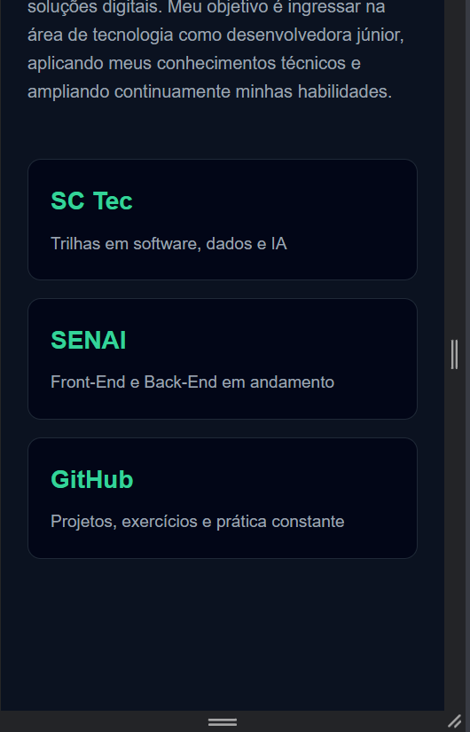
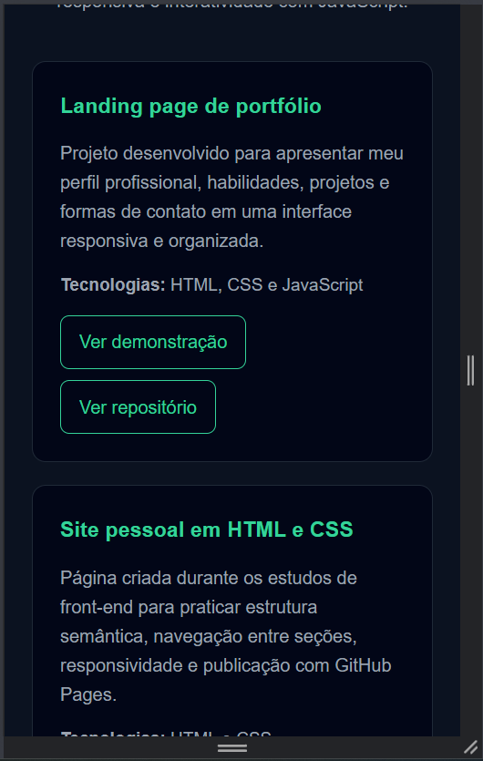
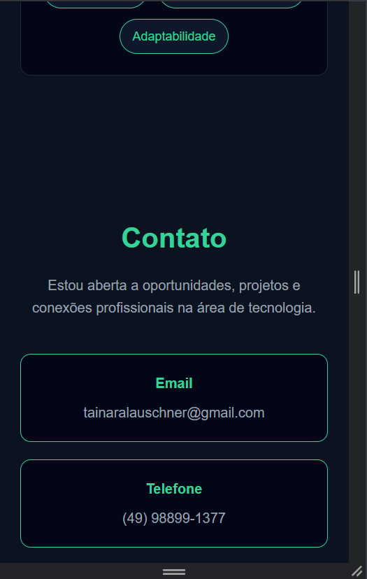
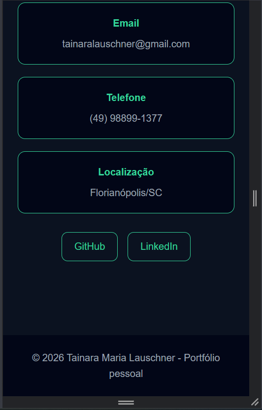

# Bug Report – Landing Page

## Aplicação testada
https://tainaralauschner.github.io/landingpage/

## BUG01 – Favicon não carregado

**Descrição:**  
Erro 404 ao carregar favicon.

**Severidade:** Baixa  

**Evidência:**  

---

## BUG02 – Ordem de conteúdo inadequada no mobile

**Descrição:**  
Imagem aparece antes do texto.

**Severidade:** Média  

**Evidência:**  

---

## BUG03 – Espaçamento excessivo

**Descrição:**  
Espaços grandes entre elementos.

**Severidade:** Baixa a Média  

**Evidência:**  

---

## BUG04 – Quebra de linha inadequada

**Descrição:**  
Texto com quebra irregular.

**Severidade:** Baixa  

**Evidência:**  

---

## BUG05 – Título muito grande no mobile

**Descrição:**  
Título ocupa muito espaço.

**Severidade:** Baixa  

**Evidência:**  

---

## BUG06 – Imagem com prioridade excessiva

**Descrição:**  
Imagem domina a tela.

**Severidade:** Média  

**Evidência:**  

---

## BUG07 – Cards com pouca margem lateral

**Descrição:**  
Cards ocupam toda largura.

**Severidade:** Baixa  

**Evidência:**  

---

## BUG08 – Inconsistência nos botões

**Descrição:**  
Textos diferentes para mesma ação.

**Severidade:** Baixa  

**Evidência:**  

---

## BUG09 – Tamanhos de botões inconsistentes

**Descrição:**  
Botões com tamanhos diferentes.

**Severidade:** Baixa  

**Evidência:**  

---

## BUG10 – Cards de contato muito grandes

**Descrição:**  
Muito espaço vertical.

**Severidade:** Baixa  

**Evidência:**  

---

## BUG11 – Botões finais com baixo destaque

**Descrição:**  
Pouco destaque visual.

**Severidade:** Baixa  

**Evidência:**  

---

## Observações

- Menu hambúrguer funcionando corretamente  
- Botões funcionando corretamente  
- Erros de console não reproduzidos em aba anônima  